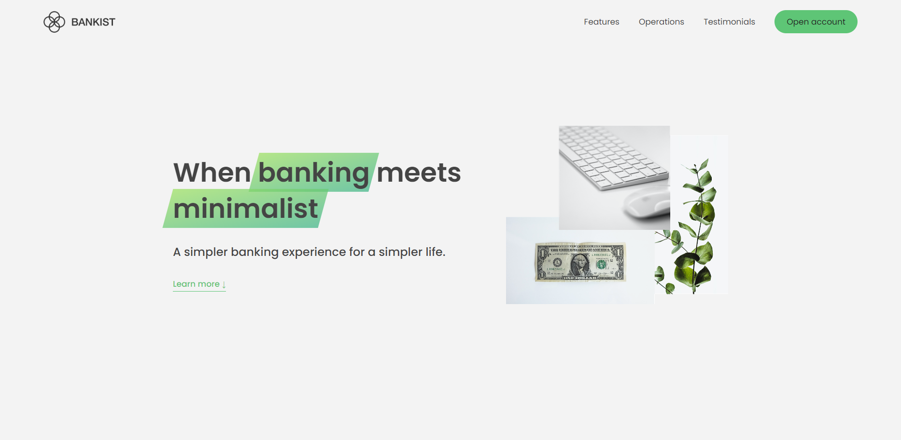

# Bankist DOM Project - Udemy JavaScript Course

## Description

This repository contains the project "Bankist DOM" developed as part of [The Complete JavaScript Course 2024: From Zero to Expert!](https://www.udemy.com/course/the-complete-javascript-course/) course on Udemy. The main focus of this project is to demonstrate DOM manipulation techniques in JavaScript.

## Features

- **Page Navigation & Tabbed Component:** Easily navigate through different sections of the application with tabbed interface.
- **Menu Fade Animation & Sticky Navigation:** Experience smooth menu animations and sticky navigation for seamless browsing.
- **Revealing Elements on Scroll:** Elements are dynamically revealed as you scroll through the page, enhancing user experience.
- **Lazy Loading Images:** Improve page loading speed by lazy loading images as they come into view.
- **Slider Component:** Enjoy interactive content with a customizable slider component.
- **And Much More:** Explore various other features and techniques implemented in the Bankist DOM project.

## Technologies Used

- HTML5 and CSS3 for the user interface.
- JavaScript for DOM manipulation.
- Vanilla JavaScript is used, without any libraries or frameworks.
- The project was developed following modern JavaScript practices and principles, including ES6 features.

## Getting Started

To run the Bankist DOM project, simply clone this repository to your local machine and open the `index.html` file in your web browser.

## Project Structure

The project follows a simple structure:

- `index.html`: The main HTML file for the project.
- `style.css`: The CSS file for styling the user interface.
- `script.js`: The main JavaScript file containing the application logic.
- `img`: A directory containing images used in the project.

## Credits

The Bankist project was created as part of [The Complete JavaScript Course 2024: From Zero to Expert!](https://www.udemy.com/course/the-complete-javascript-course/) course on Udemy, instructed by [Jonas Schmedtmann](https://www.udemy.com/user/jonasschmedtmann/). The design, code, and concepts are based on the course content.
